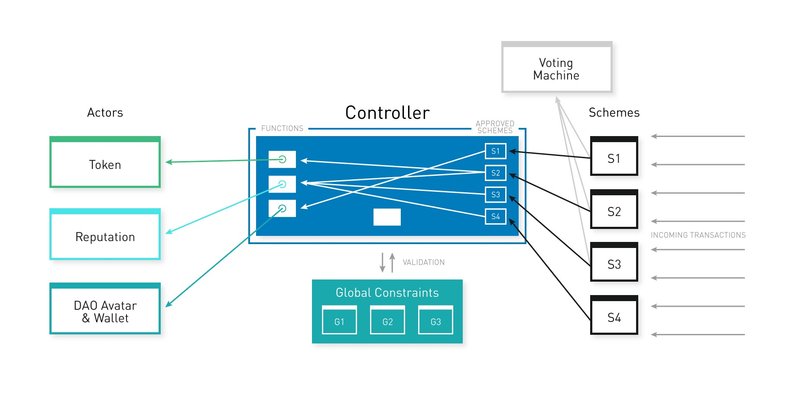

# DXdao Snapshot DB Tool

## Commands

Configure your ENV file, specify the network you want to use with the `--network` parameter and use the `--reset` parameter if you want to not use existent snapshot and restart it.
Use the `--fast` parameter if you don't want between requests, disabled by default to avoid reaching free limit rape form APIs used.
Use `--toBlock` with the maximum block you want to analyze parameter you want to use, using latest provided by the web3 provider by default. 

### Get Transactions
```
node scripts/get-transactions.js --network mainnet
```

### Build Snapshopt

```
node scripts/build-snapshopt.js --network mainnet
```

## Snapshot Format

```
{
  fromBlock: Number,
  toBlock: Number,
  controller: {
    txs: [ {
      hash: "32 Bytes: String: Hash of the transaction."
      nonce: "Number: The number of transactions made by the sender prior to this one."
      blockHash: " Bytes - String: Hash of the block where this transaction was in. null when its pending."
      blockNumber: "Number: Block number where this transaction was in. null when its pending."
      transactionIndex: "Number: Integer of the transactions index position in the block. null when its pending."
      from: "String: Address of the sender."
      to: "String: Address of the receiver. null when its a contract creation transaction."
      value: "String: Value transferred in wei."
      gasPrice: "String: Gas price provided by the sender in wei."
      gas: "Number: Gas provided by the sender."
      input: "String: The data sent along with the transaction."
      receipt: {
        status: "Boolean: TRUE if the transaction was successful, FALSE, if the EVM reverted the transaction."
        blockHash: "32 Bytes: Hash of the block where this transaction was in."
        blockNumber: "Number: Block number where this transaction was in."
        transactionHash: "32 Bytes: Hash of the transaction."
        transactionIndex: "Number: Integer of the transactions index position in the block."
        from: "String: Address of the sender."
        to: "String: Address of the receiver. null when its a contract creation transaction."
        contractAddress: "String: The contract address created, if the transaction was a contract creation, otherwise null."
        cumulativeGasUsed: "Number: The total amount of gas used when this transaction was executed in the block."
        gasUsed: "Number: The amount of gas used by this specific transaction alone."
        logs: "Array: Array of log objects, which this transaction generated."
      }
    } ... ],
    internalTxs: [ {
      status: "Boolean: TRUE if the transaction was successful, FALSE, if the EVM reverted the transaction."
      blockHash: "32 Bytes: Hash of the block where this transaction was in."
      blockNumber: "Number: Block number where this transaction was in."
      transactionHash: "32 Bytes: Hash of the transaction."
      transactionIndex: "Number: Integer of the transactions index position in the block."
      from: "String: Address of the sender."
      to: "String: Address of the receiver. null when its a contract creation transaction."
      contractAddress: "String: The contract address created, if the transaction was a contract creation, otherwise null."
      cumulativeGasUsed: "Number: The total amount of gas used when this transaction was executed in the block."
      gasUsed: "Number: The amount of gas used by this specific transaction alone."
      logs: "Array: Array of log objects, which this transaction generated."
    } ... ],
  },
  avatar: {
    txs: [ Tx ],
    internalTxs: [ TxReceipt ],
  },
  reputation: {
    txs: [ Tx ],
    internalTxs: [ TxReceipt ],
  },
  token: {
    txs: [ Tx ],
    internalTxs: [ TxReceipt ],
  },
  schemes: {
    scheme1: {
      txs: [ Tx ],
      internalTxs: [ TxReceipt ],
    },
    ...
    schemeX: {
      txs: [ Tx ],
      internalTxs: [ TxReceipt ],
    }
  }
}
```


## Main Contracts



Controller: https://etherscan.io/address/0x9f828ac3baa9003e8a4e0b24bcae7b027b6740b0
Avatar: https://etherscan.io/address/0x519b70055af55a007110b4ff99b0ea33071c720a
Reputation: https://etherscan.io/address/0x7a927a93f221976aae26d5d077477307170f0b7c
Token: https://etherscan.io/address/0x643b14f6ea235668278da5974930105852f2b7c4

## Schemes 

Creator account (Not active): https://etherscan.io/address/0x0a530100affb0a06edd2ed74e335afc50624f345
DxLockMgnForRep: https://etherscan.io/address/0x2E6FaE82c77e1D6433CCaAaF90281523b99D0D0a
DxGenAuction4Rep: https://etherscan.io/address/0x4D8DB062dEFa0254d00a44aA1602C30594e47B12
DxLockEth4Rep: https://etherscan.io/address/0x4564BFe303900178578769b2D76B1a13533E5fd5
DxLockWhitelisted4Rep: https://etherscan.io/address/0x1cb5B2BB4030220ad5417229A7A1E3c373cDD2F6
DutchX (GenericScheme1): https://etherscan.io/address/0x199719EE4d5DCF174B80b80afa1FE4a8e5b0E3A0
SchemeRegistrar: https://etherscan.io/address/0xf050F3C6772Ff35eB174A6900833243fcCD0261F
ContributionReward: https://etherscan.io/address/0x08cC7BBa91b849156e9c44DEd51896B38400f55B
EnsPublicResolver (GenericScheme2): https://etherscan.io/address/0x9A543aeF934c21Da5814785E38f9A7892D3CDE6E
EnsRegistrar (GenericScheme3): https://etherscan.io/address/0x973ce4e81BdC3bD39f46038f3AaA928B04558b08
EnsRegistry (GenericScheme4): https://etherscan.io/address/0x9CEA0DD05C4344A769B2F4C2f8890EDa8a700d64
